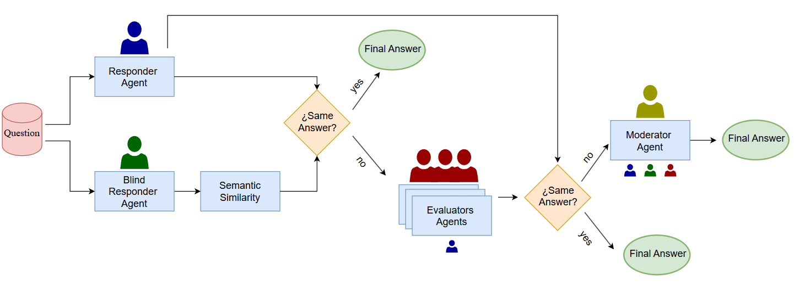

# PROFE 2025 Multi-Agent System

Welcome to **PROFE 2025**, a zero-shot multi-agent framework built on Gemini 2.5 Flash for evaluating Spanish proficiency exams under the same conditions as human learners. Developed for IberLEF 2025 and SEPLN, this repository provides a transparent, modular pipeline that mirrors the Instituto Cervantes’ exam environment.

## Overview

### Dataset

- Over ten years of official Instituto Cervantes exam texts
- Reading comprehension, vocabulary-in-context, and grammar tasks

### Challenge

- No fine-tuning on task-specific data
- Systems receive only exam instructions and sample exercises, just like human students

### Zero-Shot Approach

- Avoids training on labeled examples to simulate true out-of-domain generalization

### Professional Pipeline

- End-to-end modular design: data ingestion, agent orchestration, decision arbitration
- Fully manual implementation for transparency, reproducibility, and educational value

## Agents

### Responder Agent

- **Input**: Passage plus multiple-choice options
- **Operation**: Performs semantic analysis to select the correct choice
- **Explainability**: Generates a structured rationale citing evidence from the text
- **Use Case**: Excels when explicit textual cues align with question requirements

### Blind Responder Agent

- **Operation**: Reads only the question and passage, then generates a free-form answer
- **Semantic Matching**: Computes similarity between generated answer and each candidate option
- **Advantage**: Detects subtle distractors and enforces deeper comprehension

### Evaluator Agents

- **Role**: Review the answer not chosen by the Responder Agent
- **Task**: Independently judge whether that option could still be correct, providing a concise rationale
- **Decision Logic**:
  - If all evaluators mark it incorrect, confirm the Responder’s pick
  - If any evaluator flags it, escalate to the Mediator Agent

### Mediator Agent

- **Inputs**:
  1. Responder Agent’s selected answer and rationale
  2. Blind Responder Agent’s answer and similarity score
  3. Evaluators’ judgments and justifications
- **Resolution Strategy**: Applies a weighted evidence framework (textual grounding, semantic alignment, evaluator consensus)
- **Outcome**: Delivers a final, well-justified decision with a transparent audit trail

## Decision Pipeline

1. **Parallel Proposal**
   - Responder and Blind Responder Agents generate answers simultaneously
2. **Agreement Check**
   - If both agents agree, accept that answer immediately
3. **Evaluator Stage**
   - Evaluator Agents assess the alternative option; unanimous rejection confirms initial pick
4. **Mediation**
   - Any evaluator disagreement triggers Mediator Agent’s comprehensive review
5. **Finalization**
   - Mediator issues the ultimate answer, complete with integrated justifications

This modular architecture supports easy extension—add new agent types, swap LLM backends, or incorporate additional evaluation metrics.

## Contributing

We welcome contributions! Please open an issue or submit a pull request for improvements, bug fixes, or new agent ideas.

---